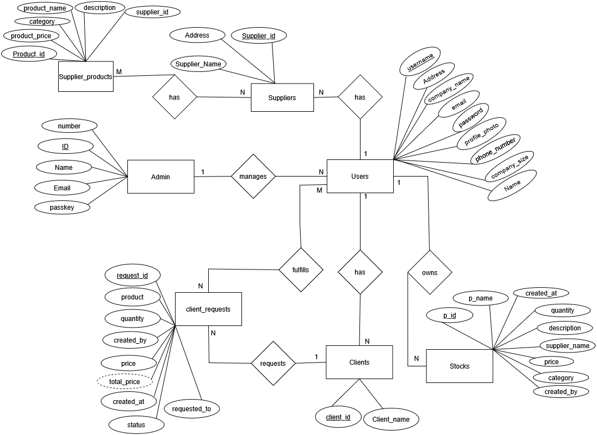
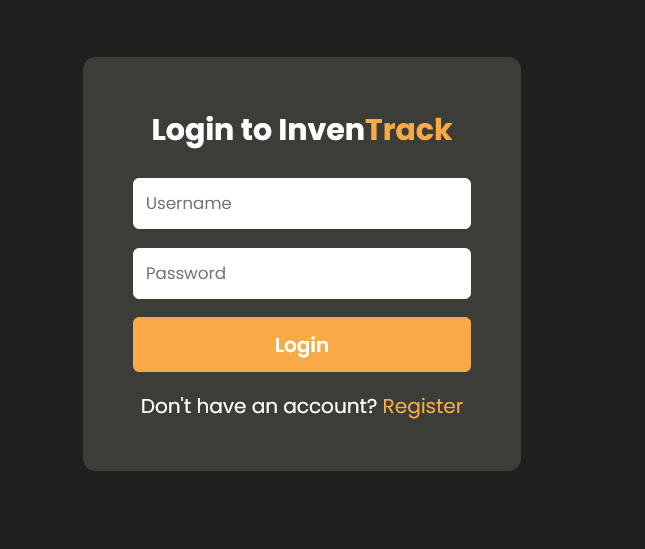
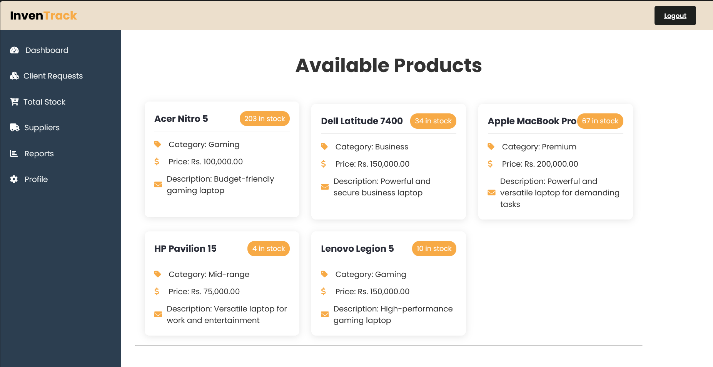

# Inventory Management System

## Project Overview
The **Inventory Management System - Inventrack** is a web-based application designed to help businesses efficiently manage inventory, track stock levels, process product requests, and streamline supplier interactions.

## Features
- Customer registration and login
- Browse available products
- Request products from inventory managers
- Track product request status
- Inventory managers can add, update, and delete inventory
- Suppliers can provide stock when unavailable
- Report generation for stock levels and requests

## Technologies Used
- **Frontend:** HTML, CSS, JavaScript
- **Backend:** PHP, MySQL
- **Database Management:** MySQL

## Installation Guide
### Prerequisites
Ensure you have the following installed:
- XAMPP (for Apache and MySQL)
- PHP
- A web browser
- Git (for cloning the repository)

### Steps to Install
1. Clone this repository:
   ```sh
   git clone https://github.com/your-username/inventory-management-system.git
   ```
2. Move the project to the XAMPP `htdocs` folder:
   ```sh
   mv inventory-management-system /xampp/htdocs/
   ```
3. Start Apache and MySQL in XAMPP.
4. Import the database:
   - Open **phpMyAdmin** in your browser.
   - Create a database named `inventory_db`.
   - Import the provided SQL file: `database/inventory_db.sql`.
5. Run the project:
   - Open your browser and go to:
     ```
     http://localhost/inventory-management-system
     ```

## Usage
1. **Customer:** Register, log in, and request products.
2. **Inventory Manager:** Manage stock, approve/reject requests, and order from suppliers.
3. **Supplier:** Provide stock when needed.

## ER Diagram
<!-- Add ER Diagram Image Here -->



## Screenshots
### Login Page
<!-- Add Login Page Screenshot Here -->


### Dashboard
<!-- Add Dashboard Screenshot Here -->


### Product Management
<!-- Add Product Management Screenshot Here -->


## Contribution
1. Fork the repository.
2. Create a new branch:
   ```sh
   git checkout -b feature-branch
   ```
3. Commit your changes:
   ```sh
   git commit -m "Added new feature"
   ```
4. Push to GitHub:
   ```sh
   git push origin feature-branch
   ```
5. Create a Pull Request.

## License
This project is open-source and available under the [MIT License](https://opensource.org/licenses/MIT). See the [LICENSE](LICENSE) file for more details.

## Contact
For any issues, feel free to reach out:
- **Name:** Damodar Khanal or Janaki kumari Rokaya
- **Email:** deepakkhanal931@gmail.com or janaki@gmail.com
